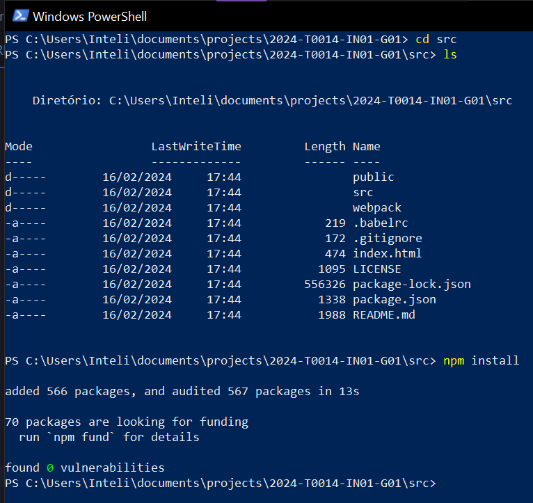
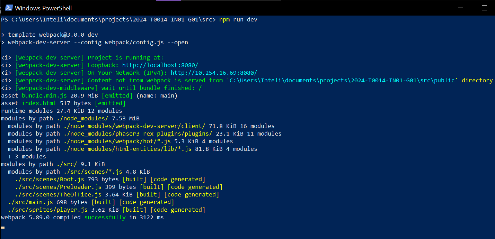

# Inteli - Instituto de Tecnologia e Liderança 

 

# Zoopliers

## Ninteli

## 👨‍🎓 Integrantes: 
- <a href="https://www.linkedin.com/in/davi-basã-a6b6561bb/">Davi Basã Henrique Alves</a>
- <a href="https://www.linkedin.com/in/gucolombini/">Gustavo Colombini</a> 
- <a href="https://www.linkedin.com/in/joao-guilherme-salomao/">João Guilherme de Jesus Salomão</a> 
- <a href="https://www.linkedin.com/in/júlia-alvesdejesus/">Júlia Alves de Jesus</a>
- <a href="https://www.linkedin.com/in/karine-victoria-822721203/">Karine Victoria Rosa da Paixão</a> 
- <a href="https://www.linkedin.com/in/lucas-ramenzoni-jorge-083770302/">Lucas Ramenzoni Jorge</a>
- <a href="https://www.linkedin.com/in/vinicius-testa-passos/">Vinicius Testa Passos</a>

## 👩‍🏫 Professores:
### Orientador(a) 
- <a href="https://www.linkedin.com/in/marcelo-gon%C3%A7alves-phd-a550652/">Marcelo Gonçalves</a>
### Instrutores
- <a href="https://www.linkedin.com/in/kizzyterra/">Kizzy Fernanda Terra Ferreira da Paz</a>
- <a href="https://www.linkedin.com/in/bruna-mayer-00a556174/">Bruna Mayer</a>
- <a href="https://www.linkedin.com/in/fillipe-resina-b2211a22/">Fillipe Manoel Xavier Resina</a> 
- <a href="https://www.linkedin.com/in/ricardo-josé-missori/">Ricardo José Missori</a>
- <a href="https://www.linkedin.com/in/egondaxbacher/">Egon Ferreira Daxbacher</a>
- <a href="https://www.linkedin.com/in/filipe-gon%C3%A7alves-08a55015b/">Filipe Gonçalves de Souza Nogueira da Silva</a>

## 📜 Descrição

&nbsp;&nbsp;&nbsp;&nbsp;&nbsp;&nbsp;O jogo foi desenvolvido com o intuito de explicar de forma divertida o processo de contratação de fornecedores. O projeto é dividido em 3 etapas, sendo elas Sourcing, Onboarding e Feedback.  

**Sourcing**  
&nbsp;&nbsp;&nbsp;&nbsp;&nbsp;&nbsp;O jogador é ensinado a importância da escolha do fornecedor correto através de dois minigames, onde ele deve filtra um entre os quatro possíveis fornecedores de acordo com os pré-requisitos da Meta e negociar os serviços para que ambos saiam satisfeitos.  

**Onboarding**  
&nbsp;&nbsp;&nbsp;&nbsp;&nbsp;&nbsp;O jogador terá um breve diálogo com o representante da empresa contratada para efetuar o serviço solicitado e deverá apresentar o escritório da Meta para o representante, tendo um breve diálogo em cada um dos ambientes apresentados.  

**Feedback**  
&nbsp;&nbsp;&nbsp;&nbsp;&nbsp;&nbsp;O jogador deve apresentar o feedback do serviço ao fornecedor com base nas opiniões dos funcionários da Meta sobre a qualidade do serviço apresentado, que aparecerão em uma pasta dentro do jogo, além de aprender a importância da Comunicação Não Violenta(CNV) nas interações profissionais.  

&nbsp;&nbsp;&nbsp;&nbsp;&nbsp;&nbsp;Dessa forma, os colaboradores da Meta conseguirão entender de forma clara, eficiente e divertida todo o processo de contratação de fornecedores através de um jogo educativo que foca nas maiores dificuldades dos funcionários da Meta para os auxiliar a entender o processo como um todo. Além disso, as etapas que não abordamos de forma aprofundada estão disponíveis no anexo em um botão no canto superior direito do jogo.  

link de acesso: https://inteli-college.github.io/2024-T0014-IN01-G01/

## 📁 Estrutura de pastas

Dentre os arquivos e pastas presentes na raiz do projeto, definem-se:

- <b>assets</b>: aqui estão os arquivos relacionados a elementos não-estruturados deste repositório, como imagens relacionadas ao jogo e apresentadas no 
    documento.

    * <b>cenarios</b>: aqui estão presentes as imagens dos cenários do jogo, presentes no documento.  
    * <b>concept arts</b>: aqui estão presentes todas as imagen relacionadas aos personagens do jogo que estão presentes no documento. 

- <b>document</b>: aqui estão todos os documentos do projeto, como o Game Development Document (GDD).

- <b>src</b>: Todo o código fonte criado para o desenvolvimento do projeto do jogo.

    * <b>dist</b>: respnsavel por armazerar os arquivos de distribuição do jogo e contem os arquivos compactados.  
    * <b>public</b>: responsavel por armazenar as assets do jogo.  
    * <b>src</b>: responsavel por armazenar o codigo fonte com as regras de negocio do projeto.  
    * <b>webpack</b>: responsavel pro armazenar as configurações de build do projeto.  

- <b>README.md</b>: arquivo que serve como guia e explicação geral sobre o projeto e o jogo (o mesmo que você está lendo agora).

## 🔧 Como executar o código

<h5> - Requisitos e ferramentas necessárias para o projeto:</h5>
<ul>
  <li>
    >= npm@10.2.4
  </li>
  <li>
    >= node@20.11.0
  </li>
  <li>
    Windows 7 ou superior 
  </li>
</ul>

<h5> - Passo a passo para execução do projeto:</h5>

  A execução do jogo depende de uma série de passos para configurar o ambiente e iniciar o projeto de forma correta.
    
  Baixadas todas as dependencias acima, podemos iniciar a instalação do projeto

<h5>
1° Passo:
</h5>

  O código fonte do projeto está dentro da pasta <b>src/</b>, antes de instalar as bibliotecas utilizadas no projeto, precisamos acessar o código fonte, para isso será necessário em um terminal aberto na pasta do projeto executarmos o comando <b>cd src</b> para acessarmos a pasta <b>src/</b> logo após devemos executar o comando para instalar as bibliotecas do projeto.
    
  Nosso projeto utiliza de um gerenciador de pacotes que ajuda o desenvolvedor a encontrar ferramentas para aprimorar a experiencia do jogo.
   
  Para instalar os pacotes do NPM vamos executar o comando <b>npm install</b> e seu terminal começara a baixar as dependencias como na imagem abaixo.

<h5>
2° Passo:
</h5>

  Feito o processo acima, precisamos executar o projeto em nosso ambiente.
   
  Para executar o projeto em ambiente de desenvolvimento, vamos executar o comando <b>npm run dev</b>.
   
  Caso o projeto seja colocado em produção devemos executar o comando ``npm run build`` e assim será gerado a build do projeto dentro da pasta ``/dist``.
    
  O console responderá assim como na imagem a baixo:
  

link de acesso: https://inteli-college.github.io/2024-T0014-IN01-G01/

## 🗃 Histórico de lançamentos

* 0.5.0 - 12/04/2024 - Adição da trilha e efeitos sonoros, adição dos NPC's, adição da interação com os NPC's, finalização da tradução para inglês
    * 
* 0.4.0 - 28/03/2024 - Adição das CutScenes, adição dos minigames de Onboarding e Feedback, adição de NPC's e correção de bugs de movimentação
    * 
* 0.3.0 - 15/03/2024 - Recriação dos mapas da cafeteria e escritório, adição dos minigames de Sourcing e de Negociação
    * 
* 0.2.0 - 01/03/2024 - Mudança do sprite do player para o coelho, adição do mapa do escritório e implementação das falas da Llama e do sistema de tradução
    * 
* 0.1.0 - 16/02/2024 - Primeira versão do mapa da cafeteria e adição do primeiro sprite do personagem com movimentação e colisão implementados 
    *

## 📋 Licença/License

<a property="dct:title" rel="cc:attributionURL" href="https://github.com/Inteli-College/2024-T0014-IN01-G01">Ninteli</a> by <a rel="cc:attributionURL dct:creator" property="cc:attributionName" href="https://www.inteli.edu.br">Inteli </a>, <a href="https://github.com/julialveszz"> Júlia Alves de Jesus </a>, <a href="https://github.com/VinTesta">Vinicius Testa Passos</a>, <a href="https://github.com/davibasa">Davi Basã Henrique Alves</a>, <a href="https://github.com/gucolombini">Gustavo Colombini</a>, <a href="https://github.com/JoaoGuilhermeSalomao">João Guilherme de Jesus Salomão</a>, <a href="https://github.com/karinevicr">Karine Victoria Rosa da Paixão</a>, <a href="https://github.com/lucasrjorge">Lucas Ramenzoni Jorge</a> is licensed under <a href="http://creativecommons.org/licenses/by/4.0/?ref=chooser-v1" target="_blank" rel="license noopener noreferrer" style="display:inline-block;">Attribution 4.0 International</a>.

