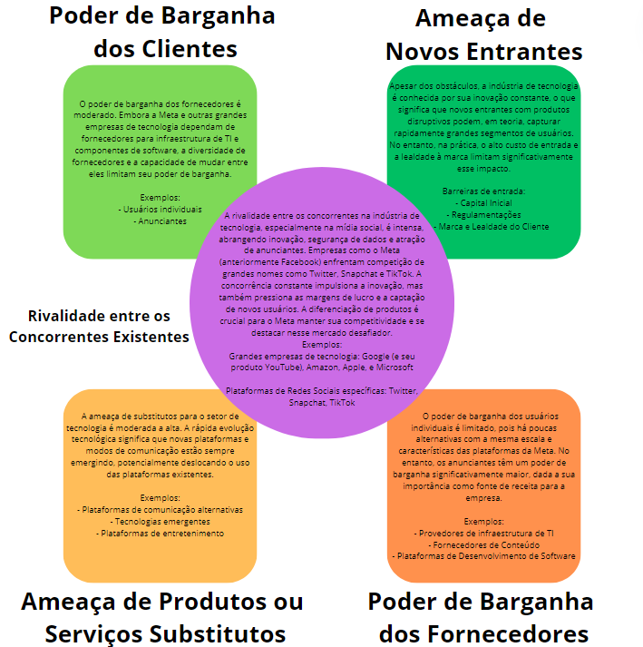

# GDD - Game Design Document - Módulo 1 - Inteli

## Ninteli

   
  
  

#### Nomes dos integrantes do grupo

[Vinicius Testa Passos](https://github.com/VinTesta)
 
[Davi Basã Henrique Alves](https://github.com/davibasa)
 
[Gustavo Colombini](https://github.com/gucolombini)
 
[João Guilherme de Jesus Salomão](https://github.com/JoaoGuilhermeSalomao)
 
[Júlia Alves de Jesus](https://github.com/julialveszz)
 
[Karine Victoria Rosa da Paixão](https://github.com/karinevicr)
 
[Lucas Ramenzoni Jorge](https://github.com/lucasrjorge)

## Sumário

[1. Introdução](#c1)

[2. Visão Geral do Jogo](#c2)

[3. Game Design](#c3)

[4. Desenvolvimento do jogo](#c4)

[5. Casos de Teste](#c5)

[6. Conclusões e trabalhos futuros](#c6)

[7. Referências](#c7)

[Anexos](#c8)

 

# 1. Introdução

## 1.1. Escopo do Projeto

### 1.1.1. Contexto da indústria

&nbsp;&nbsp;&nbsp;&nbsp;&nbsp;&nbsp;A Meta é uma empresa que atua na indústria de tecnologia e inovação, promovendo a transformação digital e conectando comunidades. A transformação digital é uma estratégia de negócios abrangente e aplicável a todos os setores, visando resolver desafios comerciais tradicionais e criar novas oportunidades por meio da tecnologia. [1]Em 2022, a Meta gerou $116,6 bilhões em receitas, sendo $113,64 bilhões provenientes das redes sociais (97,5% das receitas totais) e mais de $2,16 bilhões da Reality Labs (braço de produtos de realidade aumentada e virtual). [2]No cenário das redes sociais, três dos cinco aplicativos mais utilizados no Brasil pertencem à Meta, [3]com mais de 80% da população brasileira tendo acesso a eles. Entretanto, no mercado asiático, existem diversos produtos concorrentes da Meta, como Kwai, TikTok (que ocupa o quinto lugar no ranking brasileiro) e WeChat, que apresentam um grande potencial de crescimento.

### 1.1.2. Análise 5 Forças de Porter

&nbsp;&nbsp;&nbsp;&nbsp;&nbsp;&nbsp;O modelo das 5 Forças de Porter é uma forma de análise setorial que visa detalhar completamente a competitividade do mercado. Utilizando as Forças de Porter, temos uma visão de mercado e de viabilidade econômica mais ampla, podendo assim concluir que a competitividade vai além dos concorrentes diretos. Além da Força já citada, a competitividade entre concorrentes, a ameaça de novos entrantes, o poder de barganha dos fornecedores, o poder de barganha dos clientes e a ameaça de produtos ou serviços substitutos. Ao analisar esses elementos, as empresas podem desenvolver estratégias mais eficazes para enfrentar desafios competitivos, explorar oportunidades de mercado e ajustar sua abordagem de acordo com a dinâmica setorial.

Figura 1 - Análise 5 Forças de Porter - Tecnologia Social

Fonte: Material produzido pelos autores (2024)

### 1.1.3. Análise SWOT

&nbsp;&nbsp;&nbsp;&nbsp;&nbsp;&nbsp;A matriz SWOT é uma ferramenta de análise estratégica que visa avaliar as forças (Strengths), fraquezas (Weaknesses), oportunidades (Opportunities) e ameaças (Threats) de uma organização, projeto ou situação. Ao mapear esses quatro elementos em uma matriz, a SWOT proporciona uma visão abrangente do ambiente interno e externo, auxiliando na formulação de estratégias eficazes. As forças e fraquezas referem-se aos fatores internos da entidade, enquanto as oportunidades e ameaças envolvem aspectos externos. A análise SWOT é valiosa para orientar decisões, identificar vantagens competitivas, minimizar riscos e promover a gestão proativa, sendo amplamente utilizada por empresas e organizações em diversas áreas. 

Figura 2 - Matriz SWOT

Fonte: Material produzido pelos autores (2024)

 

### 1.1.4. Descrição da Solução Desenvolvida

#### 1.1.4.1. Qual é o problema a ser resolvido?
&nbsp;&nbsp;&nbsp;&nbsp;&nbsp;&nbsp;Desconhecimento das etapas do processo de contratação de fornecedores para a META.

#### 1.1.4.2. Quais os dados disponíveis (fonte e conteúdo - exemplo: dados da área de Compras da empresa descrevendo seus fornecedores)
&nbsp;&nbsp;&nbsp;&nbsp;&nbsp;&nbsp;Para estruturar e idealizar o projeto, tivemos muito cuidado com as nossas fontes de pesquisa e o conteúdo que estudamos, buscando um maior alinhamento aos ideais da Meta para que possamos comunicá-los com veracidade no projeto. Para isso, utilizamos como fontes de consulta o site oficial da [Meta](https://about.meta.com/br/) e a planilha de gerenciamento do ciclo de vida de um fornecedor que nos foi disponibilizado, para assim conhecer melhor como funciona esse processo.

#### 1.1.4.3. Qual a solução proposta?
&nbsp;&nbsp;&nbsp;&nbsp;&nbsp;&nbsp;Para solucionar esse problema, é necessário o desenvolvimento de um jogo que
conscientize os funcionários da META e facilite o entendimento dos processos necessários
para efetuar a contratação de um novo fornecedor.

#### 1.1.4.4. Como a solução proposta deverá ser utilizada?		
&nbsp;&nbsp;&nbsp;&nbsp;&nbsp;&nbsp;O jogo foi desenvolvido com a proposta de se tornar uma gamificação do processo de treinamento dos funcionários da Meta, a fim de ensinar de forma engajadora e dinâmica o procedimento de contratação de um novo fornecedor.

#### 1.1.4.5. Quais os benefícios trazidos pela solução proposta			       
&nbsp;&nbsp;&nbsp;&nbsp;&nbsp;&nbsp;Ao jogar o jogo, os funcionários da Meta têm a oportunidade de aprender como funciona o processo de busca, contratação e avaliação de um possível fornecedor, porém de forma mais didática e que possibilite com que o colaborador consiga facilmente selecionar fornecedores que se alinhem com os ideais da Meta.

#### 1.1.4.6. Qual será o critério de sucesso e qual medida será utilizada para o avaliar?
&nbsp;&nbsp;&nbsp;&nbsp;&nbsp;&nbsp;Para considerar a aplicação do jogo um sucesso será necessário observar alguns aspectos. Dentre eles, estão presentes o engajamento do público alvo na realização de capacitação digital e a facilidade de compreensão do processo como um todo. Para avaliar a eficiência do treinamento, será necessário avaliar o nível de entendimento do processo de seleção de fornecedores, além de aumentar a diversidade de fornecedores para se tornar algo mais acessível para as empresas.

### 1.1.5. Proposta de Valor 

&nbsp;&nbsp;&nbsp;&nbsp;&nbsp;&nbsp;O Value Proposition Canvas é uma ferramenta visual dividida em dois blocos, Perfil do Cliente e Mapa de Valor, projetada para desenvolver propostas de valor eficazes para produtos ou serviços. Ao focar nas necessidades dos clientes e na oferta de valor, a ferramenta promove o alinhamento, a interação constante e a compreensão profunda do cliente, permitindo que um projeto evolua de maneira adaptativa e alinhada às demandas do mercado. Sua aplicação facilita a melhoria contínua, ajustando a proposta com base no feedback do cliente e nas mudanças no ambiente de negócios, promovendo o desenvolvimento orgânico do projeto.

Figura 3 - Canvas da Proposta de Valor do Projeto

Fonte: Material produzido pelos autores (2024)

### 1.1.6. Matriz de Riscos 

&nbsp;&nbsp;&nbsp;&nbsp;&nbsp;&nbsp;A matriz de risco é uma ferramenta utilizada na gestão de projetos, incluindo o desenvolvimento de software, para identificar, avaliar e mitigar potenciais eventos que podem impactar negativamente o projeto. Ela organiza os riscos em uma matriz, geralmente com base na probabilidade de ocorrência e no impacto no projeto.  
&nbsp;&nbsp;&nbsp;&nbsp;&nbsp;&nbsp;No contexto do desenvolvimento de software para um negócio, a matriz de risco ajuda a equipe a antecipar e lidar proativamente com desafios potenciais, tais como atrasos, mudanças nos requisitos, falhas no sistema, entre outros. Ao identificar e priorizar os riscos, as equipes podem implementar estratégias de mitigação e contingência, melhorando assim a probabilidade de sucesso do projeto e reduzindo a possibilidade de falhas inesperadas que possam prejudicar o desenvolvimento do software e afetar negativamente o negócio como um todo.

**SPRINT 1**

Figura 4 - Matriz de Risco do Projeto - Sprint 1

Fonte: Material produzido pelos autores (2024)

Quadro 1 - Legenda da Matriz de Risco - Sprint 1
\# | Risco  
--- | ---
1 | Resistência por parte dos colaboradores as mudanças do método de treinamento  
2 | Mudanças do treinamento e/ou etapas, por parte da Meta, ao longo do tempo  
3 | Questões de propriedade intelectual (conhecimentos do treinamento da Meta)  
4 | Falta de acessibilidade no game  
5 | Jogo ser enviado contendo falhas/erros/bugs de tecnologia  
6 | Comunicação limitada ou pouco praticada entre os participantes do grupo  
7 | Perda de dados por causa de problemas operacionais das plataformas (salvamento)  
8 | Limitações no desenvolvimento de jogo pra celular (ao invés de jogo pra PC)  
9 | Erros de conteúdo educacional no jogo  
10 | O jogo não oferecer crescimento educacional (descumprimento do objetivo)  
11 | Falta de integração nos grupos de desenvolvedores  
12 | Dificuldades para alocar muitos funcionários na plataforma  
13 | Falta de didática e facilidade de entendimento no jogo  
14 | Baixo engajamento/Insatisfação dos colaboradores no Jogo  
15 | Esquecimento de alguma etapa do processo no desenvolvimento  
16 | Documentação do projeto mal escrita por parte das equipes  
17 | Instabilidade na plataforma que o jogo estará  
18 | Desistência/não conclusão do treinamento por muitos funcionários  
19 | Publicação de documentação com conteúdo restrito (exemplo: GitHub)  
20 | Exposição de dados sensíveis da Meta  
21 | Problema/bug na trilha sonora do jogo  
22 | Falta de tempo ou comprometimento dos colaboradores no jogo  
23 | Problemas de Tradução entre EN/PT no jogo  
24 | Atrasos nas entregas de desenvolvimento  
25 | Vulnerabilidade de segurança no jogo de plataforma

Fonte: Material produzido pelos autores (2024)

**SPRINT 4**

Figura 5 - Matriz de Risco do Projeto - Sprint 4

Fonte: Material produzido pelos autores (2024)

Quadro 2 - Legenda da Matriz de Risco - Sprint 4
\# | Risco  
--- | ---
1	| Resistência por parte dos colaboradores as mudanças do método de ensinamento  
2	| Falta de acessibilidade no game  
3	| Jogo ser enviado contendo falhas/erros/bugs de tecnologia  
4	| Comunicação limitada ou pouco praticada entre os participantes do grupo  
5	| Erros de conteúdo educacional no jogo  
6	| O jogo não oferecer crescimento educacional (descumprimento do objetivo)  
7	| Falta de integração nos grupos de desenvolvedores  
8	| Falta de didática e facilidade de entendimento no jogo  
9	| Baixo engajamento/Insatisfação dos colaboradores no Jogo  
10	| Documentação do projeto mal escrita por parte das equipes  
11	| Desistência/não conclusão do treinamento por muitos funcionános  
12	| Problema/bug na trilha sonora do jogo  
13	| Problemas de Tradução ente EN'PT no jogo  
14	| Atrasos nas entregas de desenvolvimento  
15	| Falta de organização na divisão de tarefas  
16	| Insatisfação da Thaís em relação aos mini games  
17	| Membro do grupo adoecer  
18	| Bugs na implementação dos NPC's  
19	| Falta de tradução para linguas além de PTBR e EN 

Fonte: Material produzido pelos autores (2024)

## 1.2. Requisitos do Projeto 
&nbsp;&nbsp;&nbsp;&nbsp;&nbsp;&nbsp;Os requisitos do projeto, mais especificamente os requisitos de gameplay, referem-se às especificações e funcionalidades que definem como o jogo deve ser jogado e o que o torna único e envolvente para o jogador. Estes requisitos são fundamentais para guiar o desenvolvimento do jogo e garantir que a equipe de desenvolvimento compartilhe uma visão clara do produto final. Aqui estão alguns dos requisitos de gameplay do projeto.

Quadro 3 - Lista de requisitos do projeto - Tecnologia Social
\# | Legenda  
--- | ---
1 | O controle do personagem será realizado usando as teclas WASD para navegação pelas fases
2 | O controle poderá ser feito por joystick em dispositivos móveis ou com touch embutido
3 | O jogo deve possuir uma tela de abertura com instruções e configurações do jogo
4 | O jogo deverá contar com sistema de colisão
5 | É necessário atalhos ou botões para que o usuário interaja com o cenário
6 | É necessário a criação de um roteiro para a história do jogo
7 | O jogo deve possuir instruções claras sobre regras, modo de jogo e movimentações

Fonte: Material produzido pelos autores (2024)

## 1.3. Público-alvo do Projeto 

O jogo tem como público-alvo todos os colaboradores da empresa Meta, pois foi desenvolvido para esclarecer um processo interno específico. Ao abranger todos os funcionários, independente de suas funções, busca-se garantir que cada membro da equipe compreenda o procedimento abordado,visando promover a uniformidade no entendimento do processo, fortalecer a coesão dentro da empresa e promover um senso de engajamento e alinhamento de objetivos.

# 2. Visão Geral do Jogo 

## 2.1. Objetivos do Jogo

&nbsp;&nbsp;&nbsp;&nbsp;&nbsp;&nbsp;O jogador tem como objetivo resolver tarefas e puzzles para compreender as etapas de contratação do fornecedor, sendo que em cada fase estará incluso uma explicação das etapas do processo para que possa dar um auxílio ao jogador.

## 2.2. Características do Jogo 

&nbsp;&nbsp;&nbsp;&nbsp;&nbsp;&nbsp;O jogo contará com uma visão ortogonal (top-down), pois assim podemos aproveitar ao máximo o framework que nos foi disponibilizado. Além disso, os personagens antropomórficos garantem que nenhum jogador, independente de raça, etnia ou gênero, se sinta mal representado, demonstrando assim a diversidade de funcionários e fornecedores que a Meta almeja a partir da diversidade de animais contida no jogo.

### 2.2.1. Gênero do Jogo 

&nbsp;&nbsp;&nbsp;&nbsp;&nbsp;&nbsp;RPG. 

### 2.2.2. Plataforma do Jogo 

&nbsp;&nbsp;&nbsp;&nbsp;&nbsp;&nbsp;Dispositivos: Desktop, smartphones e tablets.

&nbsp;&nbsp;&nbsp;&nbsp;&nbsp;&nbsp;Sistema: Web.

### 2.2.3. Número de jogadores 

&nbsp;&nbsp;&nbsp;&nbsp;&nbsp;&nbsp;1 jogador.

### 2.2.4. Títulos semelhantes e inspirações 

&nbsp;&nbsp;&nbsp;&nbsp;&nbsp;&nbsp;Dois jogos que inspiram a fazer esse jogo são Stardew Valley e The Escapits 2, tendo em vista a sua movimentação, estilo de jogo, diálogo e estilo dos personagens.

### 2.2.5. Tempo estimado de jogo 

&nbsp;&nbsp;&nbsp;&nbsp;&nbsp;&nbsp;O jogo durará cerca de 45 minutos, contendo cerca de 4 fases.

&nbsp;&nbsp;&nbsp;&nbsp;&nbsp;&nbsp;Cada fase dura cerca de 10 a 15 minutos.

# 3. Game Design 

## 3.1. Enredo do Jogo 

&nbsp;&nbsp;&nbsp;&nbsp;&nbsp;&nbsp;Em "Zoopliers", os jogadores assumem o papel de um funcionário da Meta de 2030 que entra em uma simulação do Metaverso em que todos são animais. Estando no futuro, a simulação por realidade virtual é o método de treinamento atualmente utilizado pela Meta, portanto, o personagem principal está inserido na trama com o propósito de aprender sobre a Jornada do Fornecedor, para assim concluir seu treinamento e evoluir como funcionário. Ele terá que passar por 4 fases, sendo elas a fase de Sourcing, Negociação, Onboarding e Feedback, com diversos puzzles e mini-games para conseguir finalizar o processo de contratação. E com a ajuda da Llama, que na vida real é a mais nova inteligência artificial da Meta, o jogador passará por todos os processos sendo guiado e lecionado sobre cada etapa da Jornada do Fornecedor. 

## 3.2. Personagens 

&nbsp;&nbsp;&nbsp;&nbsp;&nbsp;&nbsp;Llama: A Llama será um companheiro para o jogador que toma a forma de uma inteligência artificial com o propósito de auxiliar o colaborador da Meta a entender tudo sobre a Jornada do Fornecedor. A Llama ajudará de forma a dar dicas do que deve ser feito para concluir um minigame, explicar o por quê tal etapa do processo é importante e, de forma geral, ajudar o jogador a realmente entender o processo de contratação de um fornecedor.  
&nbsp;&nbsp;&nbsp;&nbsp;&nbsp;&nbsp;O robô em tese conhece todo o processo de contratação, busca trazer mais diversidade para empresa e auxiliar profissionais novatos a seguir o caminho rumo a contratação de um fornecedor diverso. Ele entende o fluxo total e ensina ao usuário o que é correto e errado.  
&nbsp;&nbsp;&nbsp;&nbsp;&nbsp;&nbsp;A aparência é comum a todos. Ele é um robô com traços de uma Lhama como focinho, orelhas, olhos, dentre outras características. Leva em seu design cores da Meta e traços simples, minimalistas e arredondados. Ele é chamado sempre que o jogador precisa dele. Seja para pedir uma ajuda ou instruir um processo, ele sempre estará lá. Fazendo referência a nova AI da Meta a Llama 2.

&nbsp;&nbsp;&nbsp;&nbsp;&nbsp;&nbsp;Coelho: O Coelho é o personagem principal do jogo, atuando como uma ponte entre o jogador e a história de aprendizagem do Zoopliers. As características amigáveis do coelho foram pensadas para atrair e envolver uma ampla variedade de jogadores, os engajando, entretendo e gerando identificação, enquanto descobrem a Jornada do Fornecedor.  
&nbsp;&nbsp;&nbsp;&nbsp;&nbsp;&nbsp;O Coelho é um novo estagiário na Meta que deve passar por um processo de treinamento integrado ao Metaverso, portanto, deve buscar desvendar a Jornada do Fornecedor, aprendendo sobre o processo para que possa se tornar um funcionário a par com o padrão de sua empresa.

### 3.2.1. Controláveis

&nbsp;&nbsp;&nbsp;&nbsp;&nbsp;&nbsp;Como mencionado anteriormente, o jogador assume o papel de um funcionário da Meta, tomando forma de um pequeno coelho que deve aprender sobre suas funções e obrigações na empresa. O coelho é concebido como um personagem que, se tratando de um animal, não possui uma identidade fixa, permitindo que cada jogador se conecte com ele de maneira única, conforme suas próprias vivências. O design desse personagem controlável faz uso de tons brancos e azuis, refletindo as cores da Meta de forma sucinta e esteticamente agradável. 
A idealização da narrativa de um coelho como personagem principal controlável permite uma experiência de fantasia única, proporcionando aos jogadores a oportunidade de se colocarem no papel de um animal no jogo. Além disso, o usuário é capaz de explorar cenários e interagir com outros animais de diferentes espécies e características diversas, reforçando um dos valores principais do jogo, que é a diversidade. 

Figura 6 - Concept Art do Coelho

Fonte: Material produzido pelos autores (2024)

Figura 7 - Sprite do Coelho  
  
Fonte: Material produzido pelos autores (2024)

### 3.2.2. Non-Playable Characters (NPC)

&nbsp;&nbsp;&nbsp;&nbsp;&nbsp;&nbsp;A principal personagem coadjuvante se trata da Llama, uma inteligência artificial que acompanha o jogador ao longo de todo o jogo, auxiliando e estimulando seu aprendizado. Há também diversos outros animais que o jogador poderá conhecer durante sua jogatina, como representantes de fornecedores ou seus colegas de escritório.

Figura 8 - Concept Art Llama

Fonte: Material produzido pelos autores (2024)

### 3.2.3. Diversidade e Representatividade dos Personagens

&nbsp;&nbsp;&nbsp;&nbsp;&nbsp;&nbsp;Optamos por personagens animais de diversas regiões globais, como uma arara azul da América do Sul, para promover diversidade e inclusão de uma maneira lúdica e envolvente. Com essa escolha, podemos ignorar barreiras culturais e sociais, facilitando a identificação e representação de diferentes culturas e características sem recorrer a estereótipos. Nosso time se esforçou para garantir que cada personagem não só traga alegria e cor ao jogo, mas também detalhe sobre a riqueza das tradições que representa. Ao fazer isso, Zoopliers não apenas se torna uma ferramenta educativa sobre o processo de contratação de fornecedores, mas também um espaço inclusivo onde a diversidade é celebrada e a representatividade é cuidadosamente tecida na narrativa do jogo, tornando-o acessível e engajante para todos os colaboradores da Meta.

&nbsp;&nbsp;&nbsp;&nbsp;&nbsp;&nbsp;Buscando alcançar não só representatividade e diversidade, como também acessibilidade, Zoopliers conta com duas opções linguísticas diferentes, sendo elas o Português e o Inglês. O sistema de tradução integrado facilitará a compreensão do processo por parte de todos os funcionários, independentemente de seu idioma nativo, assim garantindo que todos os membros da equipe tenham acesso ao conteúdo do jogo, promovendo a inclusão e a participação de todos.

 Figura 9 - Concept Art NPC's   
  
Fonte: Material produzido pelos autores (2024)

 Figura 10 - Concept Art NPC's 

Fonte: Material produzido pelos autores (2024)

## 3.3. Mundo do jogo

&nbsp;&nbsp;&nbsp;&nbsp;&nbsp;&nbsp;O jogo se passará inteiramente em um escritório da Meta, em que cada seção representa uma etapa do processo de contratação de um fornecedor, porém no ano de 2030 e dentro de uma simulação no ambiente de realidade virtual do Metaverso, onde todos os trabalhadores são personagem antropomórficos vestidos com trajes de trabalho.

### 3.3.1. Locações Principais e/ou Mapas 

&nbsp;&nbsp;&nbsp;&nbsp;&nbsp;&nbsp;O jogo "Zooppliers" ocorre inteiramente no escritório da Meta no ano de 2030, repleto de Easter Eggs da empresa e seus produtos. Cada localidade é pensada para imergir o jogador no ambiente de trabalho.

 Figura 11 - Cenário - Cafeteria 

Fonte: Material produzido pelos autores (2024)

Figura 11: cena de partida do personagem para começar a jornada.

&nbsp;&nbsp;&nbsp;&nbsp;&nbsp;&nbsp;Este cenário é o lounge e onde o jogo é inicializado. Nele o jogador pode interagir com os itens e descobrir alguns easter eggs, além de poder caminhar para seu escritório.

 Figura 12 - Cenário - Office 

Fonte: Material produzido pelos autores (2024)

Figura 12: cena em que ocorrerá a sua primeira fase.

&nbsp;&nbsp;&nbsp;&nbsp;&nbsp;&nbsp;Este cenário é o escritório, o lugar em que o personagem poderá realizará o minigame de Sourcing e aprende sobre seleção do fornecedor, contrato de confidencialidade e negociação, para assim passar para a próxima fase.

 Figura 13 - Cenário - Hall 

Fonte: Material produzido pelos autores (2024)

Figura 13: introdução do minigame de Onboarding.

&nbsp;&nbsp;&nbsp;&nbsp;&nbsp;&nbsp;Este cenário é o hall, onde ocorrerá a introdução do minigame de Onboarding. Nele o jogador pode interagir com o Sr. Khali e, após isso, passar para o labirinto

 Figura 14 - Cenário - Labirinto 

Fonte: Material produzido pelos autores (2024)

Figura 14: minigame de onboarding.

&nbsp;&nbsp;&nbsp;&nbsp;&nbsp;&nbsp;Aqui o jogador terá que encontrar as portas certas para apresentar os ambientes para o fornecedor.

 Figura 15 - Cenário - Jardim 

Fonte: Material produzido pelos autores (2024)

Figura 15: detalhe da cena de partida do personagem para começar as suas missões.

&nbsp;&nbsp;&nbsp;&nbsp;&nbsp;&nbsp;Esse cenário não jogavel será acessado pelo labirinto, onde so ocorrerá um breve diálogo entre o personagem principal e o fornecedor.

 Figura 16 - Cenário - Sala de reuniões 

Fonte: Material produzido pelos autores (2024)

Figura 16: Cenário da sala de reuniões, onde acontecerá o minigame de Feedback  
&nbsp;&nbsp;&nbsp;&nbsp;&nbsp;&nbsp;Cenário onde acontecerá o minigame de Feedback onde o jogador terá que entregar o feedback ao fornecedor com uma comunicação não violenta.

### 3.3.2. Navegação pelo mundo 

&nbsp;&nbsp;&nbsp;&nbsp;&nbsp;&nbsp;O jogador navegará pelo escritório da Meta de forma a, progressivamente, avançar pelas fases (os setores de trabalho da Meta) e assim aprender sobre cada etapa do processo de contratação de um fornecedor. A partir de portas espalhadas em cada sala, o colaborador poderá transitar entre as fases (as etapas do processo), onde a próxima etapa só ficará disponível após a conclusão do minigame da anterior.

### 3.3.3. Condições climáticas e temporais 

&nbsp;&nbsp;&nbsp;&nbsp;&nbsp;&nbsp;O clima e o tempo do mundo não influenciará no modo em que o jogo é jogado de nenhuma forma.

### 3.3.4. Concept Art 

&nbsp;&nbsp;&nbsp;&nbsp;&nbsp;&nbsp; [4]Na tradução literal, Concept Art significa arte conceito ou arte conceitual. Nesse sentido, sua finalidade é mostrar, através de ilustrações — pouco ou muito detalhadas —, como será o visual final de um filme ou de um game, antes dele ser produzido.  
&nbsp;&nbsp;&nbsp;&nbsp;&nbsp;&nbsp; Para a criação das Concept Arts dos cenários, nos inspiramos em cenários reais da Meta, utilizando imagens fornecidas pela Thaís, bem como as imagens disponíveis no site oficial da empresa. Já para o desenvolvimento dos personagens, grande parte da inspiração veio do filme "Zootopia", no qual os personagens são animais diversos que convivem e trabalham juntos na cidade. Essa referência foi incorporada ao contexto do escritório da Meta.

 Figura 17 - Primeira arte do jogo, teste de paleta de cores 

Fonte: Material produzido pelos autores (2024)

 Figura 18 - Brainstorm inicial de animais, escolha de animais e designs não finais 

Fonte: Material produzido pelos autores (2024)

 Figura 19 - Concept art para personagem urso   
  
Fonte: Material produzido pelos autores (2024)

### 3.3.5. Trilha sonora 

Quadro 4 - Lista de músicas utilizadas na trilha sonora do jogo
\# | Titulo | Ocorrência | Autoria
--- | --- | --- | ---
1 | [Lazy Laura](https://www.youtube.com/watch?v=25ZBDh0_jyU) | Menu inicial | [Quincas Moreira](https://www.youtube.com/channel/UCL1zFMJb0sthwdAlGjGbdyg)
2 | [Bossa Sonsa](https://www.youtube.com/watch?v=lT9qc4oEtyw) | Background cafeteria | [Quincas Moreira](https://www.youtube.com/channel/UCL1zFMJb0sthwdAlGjGbdyg)
3 | [Dont Fret](https://www.youtube.com/watch?v=RBgsfuHy8Wo) | Escritório e Minigame de Sourcing | [Quincas Moreira](https://www.youtube.com/channel/UCL1zFMJb0sthwdAlGjGbdyg)
4 | [Jazzeton](https://www.youtube.com/watch?v=UFBXVPFNTXQ) | Hall e Labirinto | [Quincas Moreira](https://www.youtube.com/channel/UCL1zFMJb0sthwdAlGjGbdyg)
5 | [Love or Lust](https://www.youtube.com/watch?v=u0cq7if3tr4) | Minigame de Feedback | [Quincas Moreira](https://www.youtube.com/channel/UCL1zFMJb0sthwdAlGjGbdyg)

Fonte: Material produzido pelos autores (2024)

## 3.4. Inventário e Bestiário 

### 3.4.1. Inventário

&nbsp;&nbsp;&nbsp;&nbsp;&nbsp;&nbsp;O jogo não utilizará nenhuma mecânica de itens ou poderes, dependendo apenas da interação do jogador com o mundo e a solução de minigames.

### 3.4.2. Bestiário

&nbsp;&nbsp;&nbsp;&nbsp;&nbsp;&nbsp;Do mesmo modo que não teremos itens ou poderes, também não estarão presentes inimigos.

## 3.5. Gameflow (Diagrama de cenas) 
&nbsp;&nbsp;&nbsp;&nbsp;&nbsp;&nbsp;[5]...é uma técnica que te permite mapear todo fluxo de telas do seu site ou aplicativo de forma rápida. Essa técnica funciona bem para alinhar os caminhos e ações que o usuário pode fazer junto com os membros do time.  
&nbsp;&nbsp;&nbsp;&nbsp;&nbsp;&nbsp;O gameflow foi criado a partir da nossa ideia de progresso do jogo, passando pelos cenários, interações e minigames.

 Figura 20 - Diagrama de cenas 

Fonte: Material produzido pelos autores (2024)

 Figura 21 - Diagrama de cenas 

Fonte: Material produzido pelos autores (2024)

 Figura 22 - Diagrama de cenas 

Fonte: Material produzido pelos autores (2024)

Link de acesso: https://www.figma.com/file/1aXLlWHJ50GOfxpMPJz1Xm/Untitled?type=whiteboard&node-id=0-1

## 3.6. Regras do jogo

&nbsp;&nbsp;&nbsp;&nbsp;&nbsp;&nbsp;O jogador deve corretamente concluir o minigame da fase em que está para poder avançar para a próxima etapa. Para auxiliá-lo, a Llama oferecerá conselhos e ensinamentos que irão garantir que o jogador entenda a Jornada do Fornecedor, assim, o progresso só poderá ser feito quando aquela etapa do processo estiver clara na mente do colaborador.

## 3.7. Mecânicas do jogo

&nbsp;&nbsp;&nbsp;&nbsp;&nbsp;&nbsp;No navegador, o jogador utilizará as teclas WASD para se locomover pelo cenário e a tecla E para interagir com o que está em volta. As interações planejadas para o jogador são: diálogos com NPC's, interações menores com objetos do cenário, abrir as portas (e assim transitar entre cenas) e iniciar minigames.
No dispositivo móvel, o jogador terá acesso a um joystick digital para se locomover, e para interagir com o cenário, um botão ativado pelo toque. As interações serão as mesmas em ambos sistemas.

# 4. Desenvolvimento do Jogo

## 4.1. Desenvolvimento preliminar do jogo

&nbsp;&nbsp;&nbsp;&nbsp;&nbsp;&nbsp;Como primeiro passo, preferimos focar na organização do projeto e padronização nas estruturas de desenvolvimento. 
Dividimos tudo em 7 passos:

**4.1.1. Estrutura de pastas**  
&nbsp;&nbsp;&nbsp;&nbsp;&nbsp;&nbsp;Utilizamos uma organização de pastas padrão para jogos desenvolvidos em phaser que seguem as boas práticas da organização de pastas e instanciação de projetos.  

**4.1.2. Adição do Tiled Maps**  
&nbsp;&nbsp;&nbsp;&nbsp;&nbsp;&nbsp;O desenvolvimento e estilização dos cenários se prova para muitas equipes um desafio. Para facilitar a criação de nosso cenários, nós implementamos o Tiled Maps que é um criador de mapas que utiliza de pixel arts
e uma UI personalizada. Isso permite que o time trabalhe simultaneamente na criação de personagens, cenários e mecânicas sem que um trabalho afete o outro permitindo assim mais flexibilidades para todos. 
Além disso o Tiled Maps facilita a implementação de recursos como a colisão de objetos.  

**4.1.3. Movimentação do personagem**  
&nbsp;&nbsp;&nbsp;&nbsp;&nbsp;&nbsp;Para que o usuário posso interagir com o cenário ele precisa ter a liberdade de se mover para onde quiser, por isso implementamos um sistema de movimentação multidirecional que permite o usuário se movimentar
pelos eixos X e Y. A implementação conta com movimentação pelo teclado utilizando as keys W, A, S e D e ainda um joystick para que o usuário possa jogar pelo celular.  

**4.1.4. Implementação de cenário**  
&nbsp;&nbsp;&nbsp;&nbsp;&nbsp;&nbsp;Aproveitando o Tiled Maps, o time desenvolveu alguns objetos para deixar o jogo mais único. Isso permite o usuário se localizar e identificar com o cenário e da um estilo único.  

**4.1.5. Implementação de colisões**  
&nbsp;&nbsp;&nbsp;&nbsp;&nbsp;&nbsp;Ainda sobre o Tiled, implementamos o sistema de colisão com alguns objetos pelo mapa para que o personagem não saia flutuando sobre tudo.  

**4.1.6. Spreadsheets e animações**  
&nbsp;&nbsp;&nbsp;&nbsp;&nbsp;&nbsp;Assim como nós, nosso personagem precisa estar sempre em movimento. Para isso nós implementamos algumas animações iniciais que permitem que o personagem se mexa durante o movimento.  

**4.1.7. Primeiro protótipo jogavel**  
&nbsp;&nbsp;&nbsp;&nbsp;&nbsp;&nbsp;Colocamos também nosso primeiro protótipo do ar permitindo que todos possam acessar em um dispositivo com navegador e conectado a internet.  
&nbsp;&nbsp;&nbsp;&nbsp;&nbsp;&nbsp;Link para acessar a primeira versão do jogo: https://meta-game-prototype.vercel.app/ 

## 4.2. Desenvolvimento básico do jogo

**4.2.1. Sistema de diálogo**  
&nbsp;&nbsp;&nbsp;&nbsp;&nbsp;&nbsp;Através do diálogo, o jogador pode conhecer o mundo e se envolver mais na história do jogo. Pensando nisso, implementamos um sistema de diálogo, no qual o jogador poderá interagir com NPCs, objetos e progredir na história. Nessa primeira versão, adicionamos apenas um diálogo com a Llama, que é o personagem que assiste o jogador durante o progresso do jogo.

Figura 23 - Sistema de diálogo

Fonte: Material produzido pelos autores (2024)

**4.2.2. Sistema de tradução**  
&nbsp;&nbsp;&nbsp;&nbsp;&nbsp;&nbsp;Acreditamos que para uma boa experiência no processo de aprendizado do jogo, é de extrema importância o entendimento total do jogador através dos diálogos e textos inseridos. Pensando nisso, implementamos dois idiomas diferentes no jogo, nos quais o jogador pode alternar sempre que precisar.

Figura 25 - Sistema de tradução - Sprint 1

Fonte: Material produzido pelos autores (2024)

**4.2.3. Menu inicial**  
&nbsp;&nbsp;&nbsp;&nbsp;&nbsp;&nbsp;Todo jogo tem um ponto âncora de início, onde o jogador pode configurar o jogo e dar início à sua jornada. Para trazer essa experiência mais próxima do jogador, implementamos a tela inicial, que conta com o sistema para escolha de idiomas e o botão de início. Ao passar por essa tela, o jogador será levado para a primeira fase.

Figura 26 - Menu inicial - Sprint 1

Fonte: Material produzido pelos autores (2024)

**4.2.4. Refatoração de código**  
&nbsp;&nbsp;&nbsp;&nbsp;&nbsp;&nbsp;Além do desenvolvimento integral do jogo, acreditamos também que é de suma importancia manutenções e refatorações constantes no código. Essas manutenções previnem bugs futuros além de acelerar futuros desenvolvimentos com abstrações e aprimoramento das arquiteturas aplicadas no código. Aproveitamos o desenvolvimento do novas cenas para refotorar o sistema e implementar algumas abstrações que auxiliaram os devs em features futuras.

Figura 27 - Refatoração de código - Sprint 1

Fonte: Material produzido pelos autores (2024)

**4.2.5. Adição de novas sprites**  
&nbsp;&nbsp;&nbsp;&nbsp;&nbsp;&nbsp;A implementação de novas sprites, animações e cenários proporciona a verdadeira experiência do usuário. Pensando nisso, estamos gradualmente redesenhando algumas sprites e aprimorando nossos mapas. A ideia é trazer, todas as semanas, não apenas novos personagens e cenários, mas também realizar melhorias gráficas em outros elementos.

Figura 28 - Novos sprites

Fonte: Material produzido pelos autores (2024)

## 4.3. Desenvolvimento intermediário do jogo

&nbsp;&nbsp;&nbsp;&nbsp;&nbsp;&nbsp;A versão intermediária do jogo até o momento inclui um sistema funcional de locomoção, diferentes salas, transição de cena, diálogo em inglês e português com escolha de idioma dentro do jogo, dois dos três minigames, e grande parte dos sprites autorais finais do jogo. Em questão do que foi adicionado desde a última sprint, as salas foram recriadas com novas texturas e colisões; As salas antes eram estruturadas em tiles de 32x32px, mas ao reestruturar elas com tilemaps em 16x16px, permitiu maior precisão na criação de mapas e também de colisões, pois as colisões antigas confundiam o jogador, que não conseguia passar por espaços onde o personagem claramente cabia. Além disso, o jogo agora está sendo renderizado em resolução 640x360, facilitando a renderização de pixel art e aumentando performance drásticamente, sendo resolução 3x menor do que antes. As cenas agora contam com um novo sistema de gerenciador de cenas, o que permite que cada cena seja planejada e programada de forma sequencial, facilitando o desenvolvimento. A maior dificuldade se deu na programação dos minigames, pois inicialmente planejávamos criá-los em HTML, e passamos bom tempo tentando fazer isso, mas devido a diversas dificuldades com a integração de HTML com o jogo, decidimos descartar essa ideia e reprogramar os jogos direto no Phaser. Nós planejamos agora finalizar o terceiro minigame, e possivelmente o jogo, nessa quarta sprint, mas é possível que tenhamos problemas similares ao que tivemos em questão dos minigames, e também devido a indecisão do grupo sobre alguns aspectos do roteiro do jogo, então teremos que discutir sobre isso o mais cedo possível.

## 4.4. Desenvolvimento final do MVP 

&nbsp;&nbsp;&nbsp;&nbsp;&nbsp;&nbsp;Em sua versão final, o MVP do jogo conta com um total de 4 minigames, 5 cenários novos e todas as outras mecânicas já citadas. Cada minigame, em conjunto com a Llama, servirá como uma aula sobre determinada etapa do processo de contratação de um fornecedor. O primeiro minigame é o de Sourcing, onde o jogador deve julgar se um prestador de serviço é adequado ou não para ser contratado, com base nos ideais e na cultura da Meta. Em seguida, vem a etapa de Negociação, onde o jogador aprende que uma negociação entre a Meta e seus fornecedores só é válida quando nenhum dos lados sai perdendo, priorizando sempre a manutenção das relações com aquele fornecedor. Após isso, temos o minigame de Onboarding, onde o jogador deve conduzir o representante da empresa escolhida pela Meta enquanto tenta encontrar o caminho para a próxima sala. E para finalizar, temos o minigame de Feedback, que tem como objetivo ensinar ao jogador a passar pelo processo de avaliação do serviço do fornecedor de forma a apontar os pontos positivos e negativos utilizando comunicação não violenta.  
&nbsp;&nbsp;&nbsp;&nbsp;&nbsp;&nbsp;Em questão de mecânica, cada minigame conta com seu próprio método de resolução e condução do aprendizado. O primeiro minigame consiste no jogador, primeiramente, ter em mente os principais critérios que a Meta busca em um fornecedor e depois aplicá-los em situações "reais", selecionando qual fornecedor se adequa mais. Após isso, temos o minigame de Negociação, onde mecanicamente está presente um sistema de randomização de eventos, onde, ao clicar para alterar um dos pontos da negociação entre o jogador e o fornecedor, outro ponto adverso surge, encarregando o jogador de balancear ativamente o nível de satisfação da Meta e do fornecedor. O terceiro minigame a ser apresentado é o de Onboarding, que terá uma mecânica mais parecida com a de um labirinto. E, por fim, o minigame de Feedback possui um sistema de escolha de diálogos, onde cada decisão do jogador impactará na avaliação final do fornecedor. Além dos minigames e do que já foi apresentado em sprints passadas, não há muitos pontos que julgamos necessários incluir no MVP. No entanto, para o futuro, planejamos implementar diversos NPCs interagíveis pelo cenário, cada um com um diálogo único sobre a seção em que trabalha, por exemplo, além de implementar toda a trilha e efeitos sonoros previstos no jogo, possibilitando que o jogo seja uma experiência não só divertida e educativa, mas também imersiva.  
&nbsp;&nbsp;&nbsp;&nbsp;&nbsp;&nbsp;Planejamos finalizar o desenvolvimento do MVP nas próximas semanas, corrigindo bugs, ajustando a formatação dos diálogos e adicionando e corrigindo as traduções para o inglês. Além disso, pretendemos incluir os NPCs com suas respectivas interações com o jogador e produzir os documentos que serão exibidos fora do jogo, por meio da função de informações adicionais que já está implementada no jogo.

## 4.5. Revisão do MVP 

&nbsp;&nbsp;&nbsp;&nbsp;&nbsp;&nbsp;Durante todo o processo de desenvolvimento do MVP, focamos na criação de 6 cenários e 4 minigames educativos, com o objetivo de oferecer aos colaboradores da Meta uma abordagem mais descontraída para compreender o processo de contratação de fornecedores. Cada minigame foi projetado para explicar de forma clara e concisa a importância de cada etapa do processo, trabalhando em conjunto com a personagem Llama para instruir os jogadores sobre os principais aspectos a serem considerados.  
&nbsp;&nbsp;&nbsp;&nbsp;&nbsp;&nbsp;O jogo é dividido em 3 etapas, sendo elas Sourcing, Onboarding e Feedback. Na primeira etapa, o jogador é ensinado a importância da escolha do fornecedor correto através de dois minigames, onde o jogador deve filtrar os possíveis fornecedores de acordo com os pré-requisitos da Meta e negociar os serviços para que ambos saiam satisfeitos. No segundo minigame, o jogador deve apresentar a empresa para o representante da empresa contratada para efetuar o serviço solicitado. E no terceiro, o jogador deve apresentar o feedback do serviço ao fornecedor com base nas opiniões dos funcionários da Meta sobre a qualidade do serviço apresentado, além de aprender a importância da Comunicação Não Violenta(CNV). 
&nbsp;&nbsp;&nbsp;&nbsp;&nbsp;&nbsp;Na última sprint, dedicamos esforços para corrigir bugs nos diálogos, implementar a tradução completa do jogo, reestruturar o sistema de diálogos, adicionar um botão de tutorial, aprimorar alguns mapas, refatorar o código dos minigames e adicionar os efeitos sonoros. Além disso, avançamos com a implementação dos NPCs pelos cenários, permitindo interações com alguns deles. 
&nbsp;&nbsp;&nbsp;&nbsp;&nbsp;&nbsp;Durante esse período, realizamos diversos playtests para identificar possíveis bugs e avaliar a clareza e objetividade das instruções de cada fase. Esses testes nos forneceram feedback valioso para realizar os ajustes necessários e garantir a finalização bem-sucedida do MVP, oferecendo aos jogadores uma experiência educativa e envolvente.

# 5. Testes 
&nbsp;&nbsp;&nbsp;&nbsp;&nbsp;&nbsp;Os testes servem para examinar todos os aspectos do jogo, desde os controles até os gráficos, garantindo seu funcionamento completo. Eles não apenas visam encontrar bugs, mas também buscam aprimorar a experiência do usuário durante o treinamento.  
&nbsp;&nbsp;&nbsp;&nbsp;&nbsp;&nbsp;Os casos de teste são conduzidos pelos próprios desenvolvedores para identificar grandes erros, como falhas de interação, bugs de movimentação e colisão. Por outro lado, os playtests são realizados por usuários externos ao desenvolvimento do projeto, com o objetivo de identificar problemas de clareza nas instruções do jogo, bugs não detectados pelos desenvolvedores e avaliar a dificuldade dos minigames.

## 5.1. Casos de Teste
Quadro 5 - Casos de teste
\# | Pré-condição | Descrição do teste | Pós-condição 
--- | --- | --- | --- 
1 | Abrir o aplicativo do jogo | Testar inicialização e funcionamento do botão START | O jogo deve ser iniciado na cena do lounge
2 | Apertar as teclas WASD ou usar o joystick para mover o personagem em partes diferentes do mapa | Testar a movimentação do personagem pelo escritório | O personagem deve conseguir se movimentar e entrar em todos os ambientes propostos
3 | Apertar as teclas W e D (ou A) ao mesmo tempo | Testar se a movimentação do personagem funciona em todos os casos | O personagem deve conseguir se movimentar diagonalmente sem problemas
4 | Apertar as teclas A e D ou W e S ao mesmo tempo | Testar se a movimentação do personagem funciona em todos os casos | O personagem deve se movimentar em alguma das duas direções pressionadas (esquerda ou direita, cima ou baixo)
5 | Posicionar o personagem na frente da porta | Testar a função de interação com a tecla E | Deve aparecer acima do personagem uma imagem da tecla “E” para interação com a porta
6 | Apertar E em frente a porta | Testar se a tecla de ação funciona para entrar em portas | A cena deve trocar, progredindo a jornada do jogador
7 | Jogador está na área onde a instrução do NPC pode ser recebida | Verificar se o prompt de interação está funcionando com NPC’s | Deve aparecer acima do personagem uma imagem da tecla “E” para o diálogo com o NPC
8 | Apertar E dentro da área de detecção do NPC | Verificar se a tela de diálogo abre e o jogador consegue ler a instrução do NPC | Deve ser possível receber instruções através da caixa de diálogo
9 | Jogador está diante de um computador com alguma tarefa interativa (exemplo: quebra-cabeça) | Testar se a colisão entre o jogador e a hitbox do computador está funcionando | Imagem da tecla de ação aparece sob a cabeça do personagem
10 | Apertar E dentro da área de detecção do computador | Testar se a tecla de ação está funcionando | Inicia-se uma atividade (puzzle, pergunta etc)
11 | Jogador se move para fora da área de detecção do computador | Testar se a colisão para de ser detectada quando deve | Imagem da tecla de ação desaparece
12 | Jogador clicou no serviço errado | Testar se o diálogo está funcionando quando ocorre um erro do jogador | Fala da Llama "esse não é o serviço que você necessita"
13 | Jogador clicou no serviço correto | Testar se o diálogo está funcionando quando o jogador acerta | Aparece os fornecedores disponíveis
14 | Jogador clicou em um dos fornecedores | Testar se o clique do mouse está mandando o jogador para a cena correta | Mudança de tela para a página de descrição de cada fornecedor
15 | Na tela de descrição do fornecedor, jogador clicou no botão de voltar |  Testar se o clique do mouse está mandando o jogador para a cena correta | Volta para a tela de seleção
16 | Clique no botão de aceitação do fornecedor errado | Testar se o clique do mouse está mandando o jogador para a cena correta | Fala da Llama sobre o motivo de não poder contratar esse fornecedor
17 | Clique no botão de aceitação do fornecedor correto | Testar se o clique do mouse está mandando o jogador para a cena correta | Fala da Llama sobre o por quê daquele ser o fornecedor certo
18 | Finalizar o minigame | Testar se a mecânica de transição de cenas está funcionando após o minigame acabar | Mudança para a tela de contrato de confidencialidade
19 | Clique na pasta de arquivos do minigame de Feedback | Testar se a pasta de arquivos abre adequadamente | Aparição das informações de dentro da pasta
20 | Clique no botão de mais informações | Testar se, após clicar no botão, o jogador é direcionado a um link externo | Abertura de um link externo com mais informações sobre o processo de contratação de fornecedores

Fonte: Material produzido pelos autores (2024)

## 5.2. Testes de jogabilidade (playtests) 

### 5.2.1. Registros de testes

#### 5.2.1.1. Teste 1
Quadro 6 - Playtest
Testador (id) | 001
--- | ---
Teste conduzido por | Julia
Idade | 19
Local | Ateliê 4
Dia | 05/03/2024
Duração | 10 minutos
Dispositivo | Computador do Lucas

Fonte: Material produzido pelos autores (2024)  

Quadro 7 - Playtest

Perguntar para o testador | Resposta do Testador
--- | ---
Já possuía experiência prévia com games? |	sim várias
Conseguiu iniciar o jogo?	| sim
O que poderia melhorar no jogo? |	Animação de idle

Fonte: Material produzido pelos autores (2024)  
Quadro 8 - Playtest

#### 5.2.1.2. Teste 2

Quadro 9 - Playtest
Testador (id) | 002
--- | ---
Teste conduzido por | Lucas
Idade | 18
Local | Ateliê 4
Dia | 05/03/2024
Duração | 10 minutos
Dispositivo | Computador do Lucas

Fonte: Material produzido pelos autores (2024)  

Quadro 10 - Playtest
Perguntar para o testador | Resposta do Testador
--- | ---
Já possuía experiência prévia com games? | Já possuia
Conseguiu iniciar o jogo?	| sim
O que gostou no jogo?	| Animações e mapa muito bons
O que poderia melhorar no jogo?	| Quando o jogador anda na diagonal o sprite buga e, ao voltar a cena inicial, o diálogo reinicia

Fonte: Material produzido pelos autores (2024)  

#### 5.2.1.3. Teste 3

Quadro 8 - Playtest
Testador (id) | 003
--- | ---
Teste conduzido por | Julia
Idade | 19
Local | Ateliê 4
Dia | 05/03/2024
Duração | 5 minutos
Dispositivo | Computador do vinicius

Fonte: Material produzido pelos autores (2024)  

Quadro 11 - Playtest

Perguntar para o testador | Resposta do Testador
--- | ---
Já possuía experiência prévia com games? | sim, é um jogador casual
Conseguiu iniciar o jogo?	| sim, intuitivo
O que poderia melhorar no jogo?	| Físicas do jogo, escrita de português

Fonte: Material produzido pelos autores (2024)  

#### 5.2.1.4. Teste 4

Quadro 12 - Playtest
Testador (id) | 004
--- | ---
Teste conduzido por | João Guilherme
Idade | 18
Local | Ateliê 4
Dia | 05/03/2024
Duração | 4 minutos
Dispositivo | Computador do João

Fonte: Material produzido pelos autores (2024)  

Quadro 13 - Playtest

Perguntar para o testador | Resposta do Testador
--- | ---
Já possuía experiência prévia com games? | sim, joga casualmente                                                      
Conseguiu iniciar o jogo?	| sim
O que poderia melhorar no jogo? |	hitbox

Fonte: Material produzido pelos autores (2024)  

#### 5.2.1.5. Teste 5

Quadro 14 - Playtest
Testador (id) | 005
--- | ---
Teste conduzido por | João Guilherme
Idade | 18
Local | Ateliê 4
Dia | 05/03/2024
Duração | 4 minutos
Dispositivo | Computador do João

Fonte: Material produzido pelos autores (2024)  

Quadro 15 - Playtest

Perguntar para o testador | Resposta do Testador
--- | ---
Já possuía experiência prévia com games? | sim, é um jogador casual
Conseguiu iniciar o jogo?	| sim
O que gostou no jogo?	| o design dos personagens
O que poderia melhorar no jogo?	| colisoes, escritorio com muitas coisas

Fonte: Material produzido pelos autores (2024)  

#### 5.2.1.6. Teste 6

Quadro 16 - Playtest
Testador (id) | 006
--- | ---
Teste conduzido por | João Guilherme
Idade | 18
Local | Ateliê 3
Dia | 28/03/2024
Duração | 10 minutos
Dispositivo | Computador do João

Fonte: Material produzido pelos autores (2024)  

Quadro 17 - Playtest

Perguntar para o testador | Resposta do Testador
--- | ---
Já possuía experiência prévia com games? | sim
Conseguiu iniciar o jogo?	| sim
Entendeu as regras e mecânicas do jogo?	| sim
Conseguiu progredir no jogo?	| sim, mas teve dificuldades na parte do labirinto
Apresentou dificuldades?	| não
Conseguiu progredir no jogo?	| sim
Apresentou dificuldades?	| apresentou dificuldades na parte do labirinto
Que nota deu ao jogo? (0-10)	| 9.5
O que gostou no jogo?	| design e minigame do labirinto
O que poderia melhorar no jogo?	| Diálogos e o botão 'recusar' no minigame do Sourcing

Fonte: Material produzido pelos autores (2024)  

#### 5.2.1.7. Teste 7

Quadro 18 - Playtest
Testador (id) | 007
--- | ---
Teste conduzido por | João Guilherme
Idade | 18
Local | Ateliê 4
Dia | 28/03/2024
Duração | 10 minutos
Dispositivo | Computador do João

Fonte: Material produzido pelos autores (2024)  

Quadro 19 - Playtest

Perguntar para o testador | Resposta do Testador
--- | ---
Já possuía experiência prévia com games? | sim
Conseguiu iniciar o jogo?	| sim
O que gostou no jogo?	| o design dos personagens
O que poderia melhorar no jogo?	| O nivel de dificuldade do labirinto

Fonte: Material produzido pelos autores (2024)  

#### 5.2.1.8. Teste 8

Quadro 20 - Playtest
Testador (id) | 008
--- | ---
Teste conduzido por | João Guilherme
Idade | 18
Local | Ateliê 4
Dia | 28/03/2024
Duração | 9 minutos
Dispositivo | Computador do João

Fonte: Material produzido pelos autores (2024)  

Quadro 21 - Playtest

Perguntar para o testador | Resposta do Testador
--- | ---
Já possuía experiência prévia com games? | sim
Conseguiu iniciar o jogo?	| sim
Que nota deu ao jogo? (0-10)	| 9
O que gostou no jogo?	| o design dos personagens
O que poderia melhorar no jogo?	| O nivel de dificuldade do labirinto

Fonte: Material produzido pelos autores (2024)  

#### 5.2.1.9. Teste 9

Quadro 22 - Playtest
Testador (id) | 009
--- | ---
  Teste conduzido por | Karine
Idade | 19
Local | Ateliê 4
Dia | 05/03/2024
Duração | 3 minutos
Dispositivo | Computador da Karine

Fonte: Material produzido pelos autores (2024)  

Quadro 23 - Playtest

Perguntar para o testador | Resposta do Testador
--- | ---
Já possuía experiência prévia com games? | sim, é um jogador casual
Conseguiu iniciar o jogo?	| sim
Entendeu as regras e mecânicas do jogo?	| sim, foi tranquilo
Conseguiu progredir no jogo?	| sim, sem dificuldades
Apresentou dificuldades?	| Não, conseguiu jogar com facilidade e afirmou ser fácil
Que nota deu ao jogo? (0-10)	| 9
O que gostou no jogo?	| Menu, design e jogabilidade
O que poderia melhorar no jogo?	| Sprite para o coelho parado e arrumar os erros de colisão, colocar cor no E

Fonte: Material produzido pelos autores (2024)  

#### 5.2.1.10. Teste 10

Quadro 24 - Playtest
Testador (id) | 010
--- | ---
Teste conduzido por | Karine
Idade | 18
Local | Inteli
Dia | 27/03/2024
Duração | 10 minutos
Dispositivo | Computador da Karine

Fonte: Material produzido pelos autores (2024)  

Quadro 25 - Playtest

Perguntar para o testador | Resposta do Testador
--- | ---
Já possuía experiência prévia com games? | sim, joga as vezes
Conseguiu iniciar o jogo?	| sim
Entendeu as regras e mecânicas do jogo?	| sim
Conseguiu progredir no jogo?	| sim
Apresentou dificuldades?	| Sim, ficou meio perdida no inicio, não entendeu o proposito do feedback, faltou uma instrução falando em relação ao game da negociação
Que nota deu ao jogo? (0-10)	| 8.7
O que gostou no jogo?	| o design dos personagens
O que poderia melhorar no jogo?	| Ficou confusa no feedback, arrumar a colisão do puff, explicar os botões, a maioria vai para as setas e aa caixa de dialogo

Fonte: Material produzido pelos autores (2024)  

#### 5.2.1.11. Teste 11

Quadro 26 - Playtest
Testador (id) | 011
--- | ---
Teste conduzido por | Julia
Idade | 20
Local | Inteli
Dia | 01/04/2024
Duração | 10 minutos
Dispositivo | Computador da Julia

Fonte: Material produzido pelos autores (2024)  

Quadro 27 - Playtest

Perguntar para o testador | Resposta do Testador
--- | ---
Já possuía experiência prévia com games? | Sim (jogos tipo minecraft)
Conseguiu iniciar o jogo?	| sim
Entendeu as regras e mecânicas do jogo?	| sim
Conseguiu progredir no jogo?	| sim
Apresentou dificuldades?	| Sim (não entendeu muito bem do que se tratava em sourcing - o que tava escolhendo na escolha de fornecedores-, não entendeu a etapa de feedback com o elefantinho)
Que nota deu ao jogo? (0-10)	| 9
O que gostou no jogo?	| o design
O que poderia melhorar no jogo?	| labirinto está confuso, sourcing, feedback (instruções ) - jogabilidade no geral

Fonte: Material produzido pelos autores (2024)  

#### 5.2.1.12. Teste 12

Quadro 28 - Playtest
Testador (id) | 012
--- | ---
Teste conduzido por | Gustavo
Idade | 47
Local | Casa do Gustavo
Dia | 02/04/2024
Duração | 40 minutos
Dispositivo | Computador do Gustavo

Fonte: Material produzido pelos autores (2024)  

Quadro 29 - Playtest

Perguntar para o testador | Resposta do Testador
--- | ---
Já possuía experiência prévia com games? | mínima, não joga há décadas
Conseguiu iniciar o jogo?	| sim
Entendeu as regras e mecânicas do jogo?	| apenas com orientação adicional
Conseguiu progredir no jogo?	| sim, mas demorou muito
Apresentou dificuldades?	| muita, principalmente com os controles, alternava entre teclado e mouse sem entender
Que nota deu ao jogo? (0-10)	| 7
O que gostou no jogo?	| Personagem, gráficos, design, conceito do jogo de negociação
O que poderia melhorar no jogo?	| Ortografia, diálogos muito repetitivos e redundantes, podem ser simplificados para não serem tão cansativos. Recomendou controlar o coelho com o mouse/toque pois acha que seria mais fácil, colisão do coelho poderia ser um pouco menos extrema

Fonte: Material produzido pelos autores (2024)  

#### 5.2.1.13. Teste 13

Quadro 30 - Playtest
Testador (id) | 013
--- | ---
Teste conduzido por | Gustavo
Idade | 18
Local | Casa do Gustavo
Dia | 02/04/2024
Duração | 7 minutos
Dispositivo | Computador do Gustavo

Fonte: Material produzido pelos autores (2024)  

Quadro 31 - Playtest

Perguntar para o testador | Resposta do Testador
--- | ---
Já possuía experiência prévia com games? | sim, é um jogador casual
Conseguiu iniciar o jogo?	| sim
Entendeu as regras e mecânicas do jogo?	| entendeu maior parte
Conseguiu progredir no jogo?	| sim
Apresentou dificuldades?	| Não
Que nota deu ao jogo? (0-10)	| 9
O que gostou no jogo?	| Personagem, gráficos, design, jogabilidade boa
O que poderia melhorar no jogo?	| Ortografia, contextualização sobre a história ao jogador

Fonte: Material produzido pelos autores (2024)  

#### 5.2.1.14. Teste 14

Quadro 32 - Playtest
Testador (id) | 014
--- | ---
Teste conduzido por | João Guilherme
Idade | 18
Local | Ateliê 4
Dia | 05/03/2024
Duração | 3 minutos
Dispositivo | Computador do João

Fonte: Material produzido pelos autores (2024)  

Quadro 33 - Playtest

Perguntar para o testador | Resposta do Testador
--- | ---
Já possuía experiência prévia com games? | sim, é um jogador casual
Conseguiu iniciar o jogo?	| sim
Entendeu as regras e mecânicas do jogo?	| sim
Conseguiu progredir no jogo?	| sim, porem apresentou dificuldades
Apresentou dificuldades?	| não
Que nota deu ao jogo? (0-10)	| 9
O que gostou no jogo?	| o design no geral
O que poderia melhorar no jogo?	| colisões

Fonte: Material produzido pelos autores (2024)  

#### 5.2.1.15. Teste 15

Quadro 34 - Playtest
Testador (id) | 015
--- | ---
Teste conduzido por | Karine
Idade | 18
Local | R01
Dia | 04/04/2024
Duração | 5 minutos
Dispositivo | Computador do Vinicius

Fonte: Material produzido pelos autores (2024)  

Quadro 35 - Playtest

Perguntar para o testador | Resposta do Testador
--- | ---
Já possuía experiência prévia com games? | sim
Conseguiu iniciar o jogo?	| sim
Entendeu as regras e mecânicas do jogo?	| Entendeu, porém prefere jogar nas setas
Conseguiu progredir no jogo?	| Conseguiu, achou a pasta do feedback nada intuitiva. Botão de interação não some após interagir
Apresentou dificuldades?	| não
Que nota deu ao jogo? (0-10)	| 7
O que gostou no jogo?	| Visual muito bonito, jogo é bem conduzido e os personagens são carismáticos
O que poderia melhorar no jogo?	| Falta trilha sonora e efeitos sonoros, gostaria se Llama falasse, labirinto está voltando para o início. Llama fala muito

Fonte: Material produzido pelos autores (2024)  

#### 5.2.1.16. Teste 16

Quadro 36 - Playtest
Testador (id) | 016
--- | ---
Teste conduzido por | Julia
Idade | 19
Local | Ateliê 4
Dia | 05/03/2024
Duração | 5 minutos
Dispositivo | Computador do Vinicius

Fonte: Material produzido pelos autores (2024)  

Quadro 37 - Playtest

Perguntar para o testador | Resposta do Testador
--- | ---
Já possuía experiência prévia com games? | sim, mas somente em consoles
Conseguiu iniciar o jogo?	| sim
Entendeu as regras e mecânicas do jogo?	| sim
Conseguiu progredir no jogo?	| Teve problemas para encontrar a porta
Apresentou dificuldades?	| Minigame de sourcing está bugado, diálogos fora de lugar e o fornecedor correto não é o correto para o minigame
Que nota deu ao jogo? (0-10)	| 9
O que gostou no jogo?	| Artes e a mecânica dos minigames
O que poderia melhorar no jogo?	| Melhorar a posição dos diálogos no minigame

Fonte: Material produzido pelos autores (2024)  

#### 5.2.1.17. Teste 17

Quadro 38 - Playtest
Testador (id) | 017
--- | ---
Teste conduzido por | João Guilherme
Idade | 21
Local | Ateliê 3
Dia | 01/04/2024
Duração | 9 minutos
Dispositivo | Computador do João

Fonte: Material produzido pelos autores (2024)  

Quadro 39 - Playtest

Perguntar para o testador | Resposta do Testador
--- | ---
Já possuía experiência prévia com games? | pouca experiência
Conseguiu iniciar o jogo?	| sim
Entendeu as regras e mecânicas do jogo?	| sim
Conseguiu progredir no jogo?	| sem problemas
Apresentou dificuldades?	| não
Que nota deu ao jogo? (0-10)	| 8
O que gostou no jogo?	| o design dos personagens e dos mapas
O que poderia melhorar no jogo?	| Algumas colisões, a escrita dos feedbacks e o design do minigame do feedback

Fonte: Material produzido pelos autores (2024)  

#### 5.2.1.18. Teste 18

Quadro 40 - Playtest
Testador (id) | 018
--- | ---
Teste conduzido por | Lucas
Idade | 21
Local | Inteli
Dia | 01/04/2024
Duração | 9 minutos
Dispositivo | Computador do Lucas

Fonte: Material produzido pelos autores (2024)  

Quadro 41 - Playtest

Perguntar para o testador | Resposta do Testador
--- | ---
Já possuía experiência prévia com games? | sim
Conseguiu iniciar o jogo?	| sim
Entendeu as regras e mecânicas do jogo?	| Sim muito intuitivo e bem legal
Conseguiu progredir no jogo?	| sem problemas
Apresentou dificuldades?	| não
Que nota deu ao jogo? (0-10)	| 8.5
O que gostou no jogo?	| Arte, personagem é rápido e progressão fica flúida. Mecânicas fáceis de entender
O que poderia melhorar no jogo?	| 'E' não sai da tela após o Jardim. Física do Sr Kahli. Adição de trilha sonora

Fonte: Material produzido pelos autores (2024)  

### 5.2.2 Melhorias

Quadro 41 - Playtest

\# | Pontos de melhoria
--- | ---
1 | Arrumar a formatação do sistema de diálogo
2 | Corrigir os textos dos diálogos
3 | Corrigir as traduções para o inglês
4 | Arrumar algumas colisões
5 | Deixa o tutorial mais claro
6 | Colocar NPC's para enriquecer o cenário

Fonte: Material produzido pelos autores (2024)  

# 6. Conclusões e trabalhos futuros 

&nbsp;&nbsp;&nbsp;&nbsp;&nbsp;&nbsp;Após a conclusão do desenvolvimento do MVP, podemos afirmar que alcançamos nossos objetivos de maneira bem-sucedida. Entre esses marcos alcançados, merecem destaque a implementação de 4 minigames com mecânicas fáceis de entender, a tradução completa do jogo para o inglês e a disponibilidade para plataformas de computador e dispositivos móveis. Essas conquistas refletem nosso compromisso em oferecer uma experiência de jogo educativa e envolvente aos colaboradores da Meta, alinhada com nossa missão de proporcionar um treinamento eficaz sobre o processo de contratação de fornecedores.  
&nbsp;&nbsp;&nbsp;&nbsp;&nbsp;&nbsp;Apesar do sucesso alcançado, reconhecemos que ainda há espaço para planos futuros significativos. Nesse sentido, alguns pontos de aprimoramento incluem a necessidade de refatoração do código para otimizar os processos dentro do jogo, a correção de eventuais bugs de colisão que possam comprometer a jogabilidade, a expansão da tradução do jogo para idiomas além do inglês, visando alcançar uma audiência mais ampla, e a adição de interações mais dinâmicas do jogador com os objetos do cenário, tornando a experiência ainda mais imersiva e interativa. Além disso, uma proposta para o desenvolvimento futuro inclui a adição de um recurso de customização para o personagem principal jogável, o coelho, visando aprimorar a experiência de jogo, ampliando a inclusão de diversidade e também elevando o nível de identificação dos jogadores com o personagem, de forma personalizada.  
&nbsp;&nbsp;&nbsp;&nbsp;&nbsp;&nbsp;Isso não apenas contribuirá para aperfeiçoamento do jogo, mas também fortalecerá nossa capacidade de fornecer um treinamento de alta qualidade aos colaboradores da Meta, garantindo que estejamos sempre em sintonia com as expectativas e necessidades de nosso público-alvo.  

# 7. Referências

[1] Portal Insights. Quanto fatura a Meta?. Disponível em: https://www.portalinsights.com.br/perguntas-frequentes/quanto-fatura-o-meta. Acesso em: 14 fev. 2024  
[2] Escola de E-commerce by Tray. Redes sociais mais usadas no Brasil: Veja o ranking atualizado e defina a melhor para o seu negócio!. Disponível em: https://www.tray.com.br/escola/redes-sociais-mais-usadas-no-brasil/#:~:text=O%20WhatsApp%20assumiu%20a%20primeira,pelo%20Instagram%20e%20o%20Facebook. Acesso em: 14 fev. 2024  
[3] G1. Acesso à internet cresce no Brasil e chega a 84% da população em 2023, diz pesquisa. Disponível em: https://g1.globo.com/tecnologia/noticia/2023/11/16/acesso-a-internet-cresce-no-brasil-e-chega-a-84percent-da-populacao-em-2023-diz-pesquisa.ghtml. Acesso em: 29 mar. 2024  
[4] Aela School. O Que é Concept Art?. Disponível em: https://aelaschool.com/pt/designvisual/o-que-e-concept-art/. Acesso em: 29 mar. 2024
[5] Medium. Fluxo de usuário (User Flow): O que é? Como fazer?. Disponível em: https://medium.com/7bits/fluxo-de-usuário-user-flow-o-que-é-como-fazer-79d965872534. Acesso em: 09 abr. 2024

# Anexos
## Anexo 1 
Esse anexo é um link para a planilha onde estão listados todos os casos de testes realizados pelo grupo.
https://docs.google.com/spreadsheets/d/1V8RHWeCGHXg8d2hw42PTkaZfby3lgplKjBJ5P3RnxVM/edit#gid=0 

## Anexo 2 
Este anexo é um link para o quadro Figma do diagrama de cenas do jogo Zoopliers. 
https://www.figma.com/file/1aXLlWHJ50GOfxpMPJz1Xm/Untitled?type=whiteboard&node-id=0-1 
